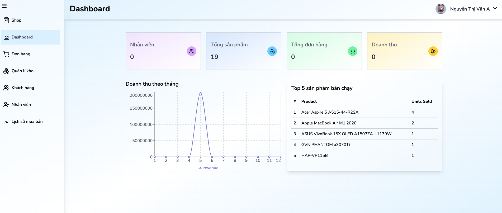
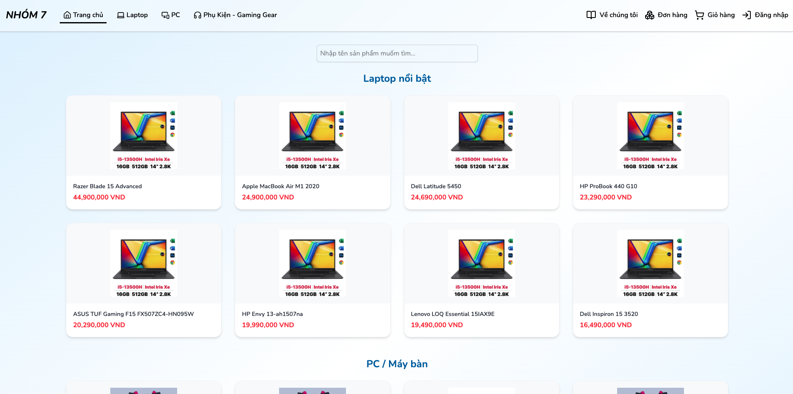

# 💻 Computer Shop Management System

A full-stack web application to manage a computer shop, including user authentication, product management, order tracking, and a customer-facing shopping experience.

---

## 🚀 Features

- 🔐 User authentication (login/register/forgot password)
- 🛒 Online shopping with cart and order confirmation
- 📦 Product and inventory management
- 🧾 Sales history and order tracking
- 🧑‍💼 Admin & employee role support
- 📊 Dashboard with real-time statistics
- 🧠 AI-based product recommendations *(via AI route)*

---

## 🛠 Tech Stack

### Frontend
- React (with Vite)
- Tailwind CSS
- React Router
- Toastify for notifications
- Context API for auth/cart

### Backend
- Node.js + Express.js
- MySQL
- JWT for authentication
- Multer for file uploads
- Nodemailer for email services

---

## 🧑‍💻 Getting Started

### 1. Clone the repo

```bash
git clone https://github.com/DangKkhoa/computer-shop-management-react-complete.git

# Start backend
cd backend
npm install
npm start

# Start frontend
cd frontend
npm install
npm run dev
```

## 🖼️ Screenshots

### 🛒 Dashboard


### 📊 Shop


### 🧾 Login


